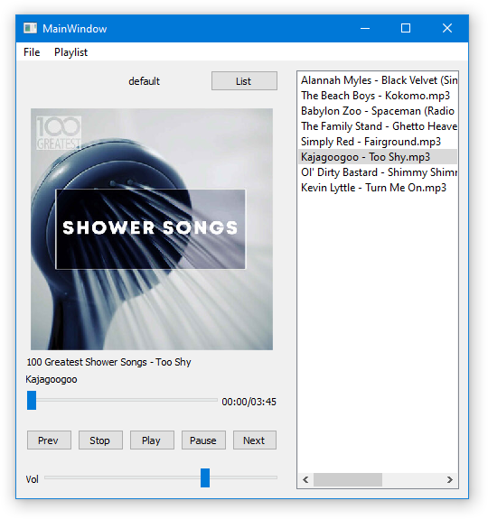

# General
Simple desktop music player.

Implemented using:
- python3
- pyqt5

Features:
- Basic media player controller
- Create playlists
- Save / Load system




# How to install
You can use any virtual environments.
```
pipenv install
# pip install -r requirements.txt
python main.py
```
